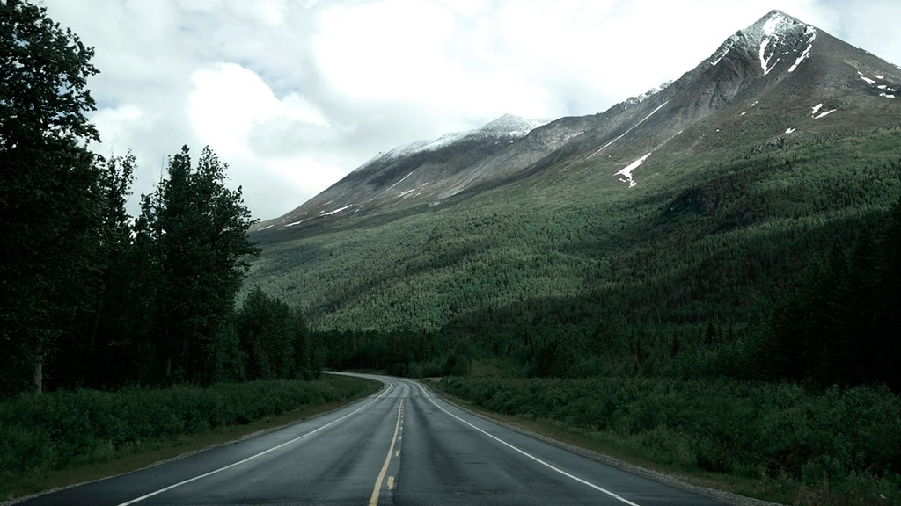

_<small>I was supposed to title this post "There's no hit and miss for Him". Instead, I thought the current title best suits the purpose of my writing. This post is more of a testimony and so I have separated it into a series. Let's read on...</small>_

I like to trace back my behaviors and patterns, about why I do what I do. I find that nobody has offended me more than myself. I have hurt myself more than anyone can hurt me. I have fallen in love so-so many times. Ahem, it's true, I have looked and stared at women. Sometimes to the point I said deep within "don't do it!", but still do it. It didn't matter if the girl was single or seeing someone, I'll be any Hollywood/Bollywood hero.

I would pray, and get restored for some time and then back on a roll. Head over heels, I'm there, all out. Falling harder than I thought. Thankfully, it was all just hit and miss. I knew for certain, that what I was doing was wrong. It was not helping me at all. I would still do it, just enjoy the rush, the feelings, the love, and the dreams, etc. I lost my identity, you might say, and I agree. I forgot who I was and what my purpose in life is. But _In spiritual terms, those are clear signs of a demonically oppressed person_.

Even just a look from any girl, made me act so cool as if I have won the whole world😎. Taking a selfie and look at me - _" how adorable I am"_. Somedays, I would be brave enough to be Joseph who would want to run away from Potiphar's wife. But some days, I am David, looking and staring at Bathsheba. And still some days, if the character fits like Rachel (depending on how much I like), I would be the Jacob for years and years to come.

I would try to suppress my feelings but it would come out all the more and show off in some other way. Rain or sunshine, I'll be crying bitterly, with my earphones on, just so that people can think I'm talking to someone. I was emotionally drained, doctrinal corrections, relationship issues, issues at home, and just even the thoughts of rejection of any of these is something I just couldn't handle.

I couldn't do well in my job because the thoughts were so constant and heavy that it would make me drowsy, fearful of getting fired (almost 3 times), the same pair of clothes, shoes, going hungry since no money in my pocket and tell everyone I'm fasting, all happening simultaneously.

People around me might have labeled me as a melancholy personality. But it was heavily affecting my career, on what I should be focusing on, learn new things, be the best in my craft.

Keeping things short - those are just a few of the many of _**"my great exploits"**_. Kingdom work was not an option because of the kind of theology that I was going around with. I was not stable myself. I was afraid that I would do more harm than do any good.

> _I (Christ) will build My church, and the gates of Hades shall not prevail against it.  **- Matthew 16:18**_

So why write all this!!?, you might even miss any future prospect, my friend!!. Oh, I don't mind missing a few more (whispering). Do you see? that's not the point.

I think God knows what He's doing. Let's <a href="/a-baby-christian">continue reading</a>.

<small>**Few scriptures to ref:**
<em>**Proverbs 7:7** - I saw among the inexperienced, I noticed among the youths, a young man lacking sense.
**Proverbs 15:21** - Folly is a joy to him who lacks sense, but a man of understanding walks straight ahead.
</em>
</small>
