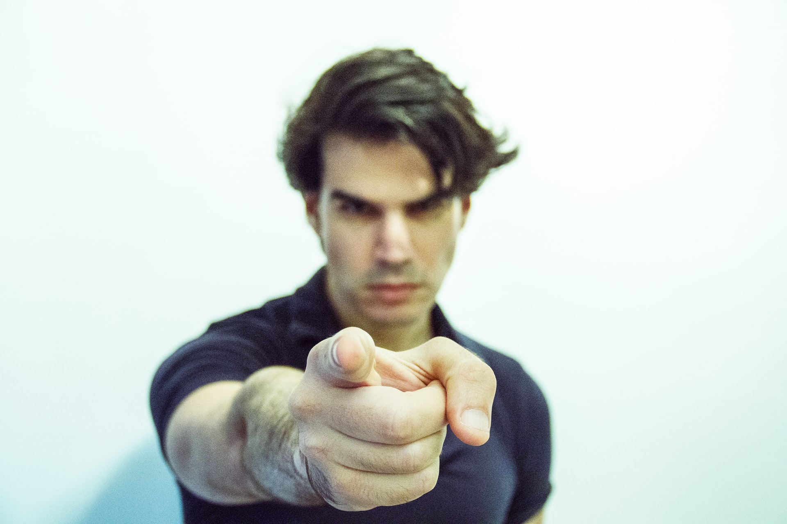

<!-- 
<small>Photo by <a href="https://unsplash.com/@adigold1?utm_source=unsplash&utm_medium=referral&utm_content=creditCopyText">Adi Goldstein</a> on <a href="https://unsplash.com/s/photos/argument?utm_source=unsplash&utm_medium=referral&utm_content=creditCopyText">Unsplash</a></small> -->

<!-- > We all know the verse "to him who knows to do good and does not do it, to him it is sin". -->

In an age of showing concern or raising a voice, staying quiet is considered a sin. But considering the things shared these days on social media, through status updates, or even private groups, you know that a lot of things that is shared is not right and you get impatient but can't help but make some comment - <a href="/watch-your-thoughts">I've been there</a>. You want to bring in a better perspective, but how do you do it?.

Honestly, I do not know. I'm a complete introvert when it comes to online presence or even otherwise I tread so carefully. I have resorted to a much better place and that is _learning how to listen_. Listening to what is being shared. Of course, It matters what the subject or the issue is about, but in most cases, there is no need to indulge in just about everything.

> _Even a fool is counted wise when he holds his peace;
When he shuts his lips, he is considered perceptive._ - **Proverbs 17:28**

Every day so much content is posted, the majority of it just feeds on _what we want to listen_. Something _that makes us feel good about ourselves_. Some are driven with an agenda to keep brainwashing the people (they don't know they do it 😢). Some are just trying to make a point. Our fads/ideologies need a constant level of energy/refuelling to sustain them. Eventually, it will drain us out. Truth doesn't need any of that. Truth can defend itself and sustain itself. It doesn't have a deadline, no expiry.

It's a battle of the minds and although the battle may have gotten a little fierce with the rise of the Internet. So much of information is available just at finger tips. We all want to be a watchdog, but somehow doesn't help. We can find comfort in knowing that we do not fight flesh and blood. The victory belongs to the Lord, He's already secured it. If I try to fight something which is already won, it's foolishness. It's difficult to change the minds which have made the internet their source for truth, for their fickle emotions keep feeding on such untrusted information. Only the Lord can change the minds, nothing is impossible with Him.

> _The opposite of love is not hate, it's indifference. - **Elie Wiesel**_

A question we do need to ask ourselves is _"am I my brother's keeper?"_ and the answer is always _"Yes sir, you are!"_. There is one thing you can definitely do and that is - _pray for them_. There is a better way and that is _love_ - (of course without compromising on truth). Just the way God's love for us suffers long, wait for God's timing, God has to soften their hearts, without which it's a battle you and I can never win.
