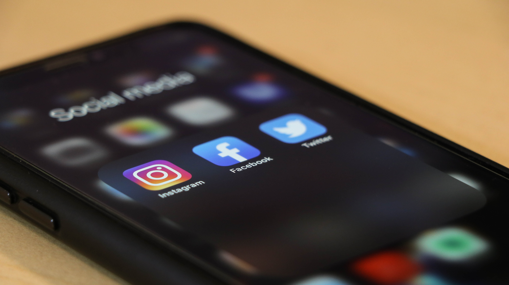

<small>Photo by <a href="https://unsplash.com/@camstejim?utm_source=unsplash&utm_medium=referral&utm_content=creditCopyText">camilo jimenez</a> on <a href="https://unsplash.com/s/photos/social-media?utm_source=unsplash&utm_medium=referral&utm_content=creditCopyText">Unsplash</a></small>

Countless hours are spent scrolling through profiles and pages. What we scroll is just _user-generated content_. It keeps feeding our craving for such information. _It's designed that way_, to keep us longer, come back again and again just to see what our friends have posted - curiosity kills the cat. And just in case if you missed a day or two, the notifications will do the perfect job of getting you back. Guess what! if Facebook doesn't do it, maybe Twitter will, or Youtube, or Snapchat, or some other startup will come up and get you hooked to their cool new website or app.

Have you wondered, why so many apps?. Hundreds of new social media apps, dating, camera filter, create memes and videos, and with an easy option to share it on any other platform. Some have a long-term goal of giving their app for free, and push ads, click-click, and voila! free flow of money.

When it comes to user-generated content, Youtube has surpassed them all, (besides plenty others - I refrain from using the names). Everyone has become a free guide/mentor, a free flow of advice. Type "how-to" in the search box and you'll get plenty of information on any given topic. A crazy load of junk is pushed in every single day. Those servers have been running hard all day long. But for you and me, it's like it - like it - subscribe it, ring the bell icon and that'll make the guys who created the content happy and then share the same junk on profiles and pages.

The algorithms are designed in such a way to make sure you get their content first every time you land that site or app again. Google or anyone else out there isn't bothered about how it's affecting people and minds. It's what they get out of it. More the users are engaged on the site, you get the revenue through advertisements, it doesn't matter if you shell out a few bucks to those who create the content, (I may be missing something here but you get the idea). Again, not everything is bad, creativity has taken a new dimension, but you will agree that there's also plenty of junk. Even the most wisest find it difficult to navigate without clicking any of those links. Can anything be done about it?. hmm...🤔

<!-- #### The Era of Smartphones -->
Though we (and every other country) are still growing. We have a good number of educated and non-educated, and the labourers. Smartphones are available to everyone. And so it's very easy to get your target or even not targeted audience. They all get excited with the kind of content, the apps, to make funny stuff, and share it, young and old, men and woman have all fallen prey to the disease. It gives them the power to create what they crave! - temporary attention, fading recognition, you name it.

We don't even know what we have gotten into. Can you blame the system? our leaders?. The economy has been running an all time low. It's a whole lot of stress for the leaders. You and I cannot blame the political party no matter who it is. Party's will come and go. But history will repeat itself if the change doesn't start with us - every - single - individual.

> _The smartphone is causing a social reversal: the desire to be alone in public and never alone in private. **-Tony Reinke**_

I use social media too - in moderation. I am concerned about my friends and families who are busy scrolling without realising how their time goes by. Our 24 hours have reduced to just 2-3 hours of real productivity work, and if lucky some sleep. Imagine these kinda addictions get into some of the still-developing countries, not to forget us Indians, who are still trying to catch up with the developed ones.

Technology indeed has helped a lot. We can connect from literally anywhere. Work from home, group meetings, family and friends gatherings couldn't have been possible without it  (especially in lockdown). A good number of people use social media to keep up with their friends and families, wish them on their birthdays and anniversaries, post some life events and it's all good. But some just don't know how their life has gone by.

Why wait for an inspiration to strike? or a situation to arise, why not take some time to do some productivity, or just do something. Why not learn to sweat a little and bring some food to the table, won't you/your family be proud of it. Why not make some plans, a to-do list, some goals, and work through it (now don't be sitting just making plans).

I don't mean to discourage using but, those sites are gonna look empty without people posting and commenting. but you'll get used to it. You will be working on the task that is at hand. Things that matter. It doesn't always have to be something big, It's the way you think. It could be something really small and yet making a lot of difference.

**Take home:**
- Take a step back, count the cost.
- Start making some real plans, set priorities.
- What are the obstacles, how can you overcome them.

----
Source and reference: <a href="https://en.m.wikipedia.org/wiki/User-generated_content#Media_pluralism" target="_blank">Media Pluralism</a>, <a href="https://en.m.wikipedia.org/wiki/User-generated_content#Motivation_for_creating_UGC" target="_blank">Motivation for user generated content</a>, <a href="https://en.wikipedia.org/wiki/Subscription_business_model" target="_blank">Subscription Business Model</a>, <a href="https://www.pewresearch.org/internet/fact-sheet/social-media/" target="_blank">Pewresearch</a>, <a href="https://backlinko.com/social-media-users" target="_blank">Backlinko</a>, <a href="https://www.smartinsights.com/social-media-marketing/social-media-strategy/new-global-social-media-research/" target="_blank">Smartnsights</a>
